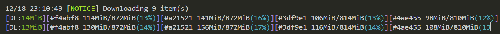

# 1. 地学数据快速下载

## 本地下载
- [x] ECMWF: <https://cds.climate.copernicus.eu>
- [x] Earthdata: <https://earthdata.nasa.gov>
- [x] MODIS: <https://e4ftl01.cr.usgs.gov>

## GEE下载

- [x] 切站点数据，[st_extract_ERA5L_SM_st2000.js](src/GEE/st_extract_ERA5L_SM_st2000.js)
- [ ] 下载tif数据

## 1.1. ECMWF

### 1.1.1. cdsapi批量提交任务

> 需要设置`wait_until_complete=False`，否则会等待文件处理好，才会进行下一个文件

```py
client = cdsapi.Client(wait_until_complete=False)
```

完整代码见：[submit_ERA5L_batch.py](src/ECMWF/submit_ERA5L_batch.py)

```powershell

### 1.1.2. aria2c下载

> 打开`down_cdsapi.R`文件，设置`target_last`。否则程序一直循环运行，不会结束。

```powershell
down_cdsapi.bat
```

完整代码见：[down_cdsapi.R](src/ECMWF/down_cdsapi.R)


