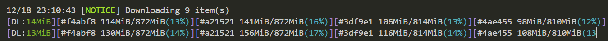

## 快速下载ECMWF数据

### 1. cdsapi批量提交任务

> 需要设置`wait_until_complete=False`，否则会等待文件处理好，才会进行下一个文件

```py
client = cdsapi.Client(wait_until_complete=False)
```

### 2. aria2c下载

> 打开`down_cdsapi.R`文件，设置`target_last`。否则程序一直循环运行，不会结束。

```powershell
down_cdsapi.bat
```


